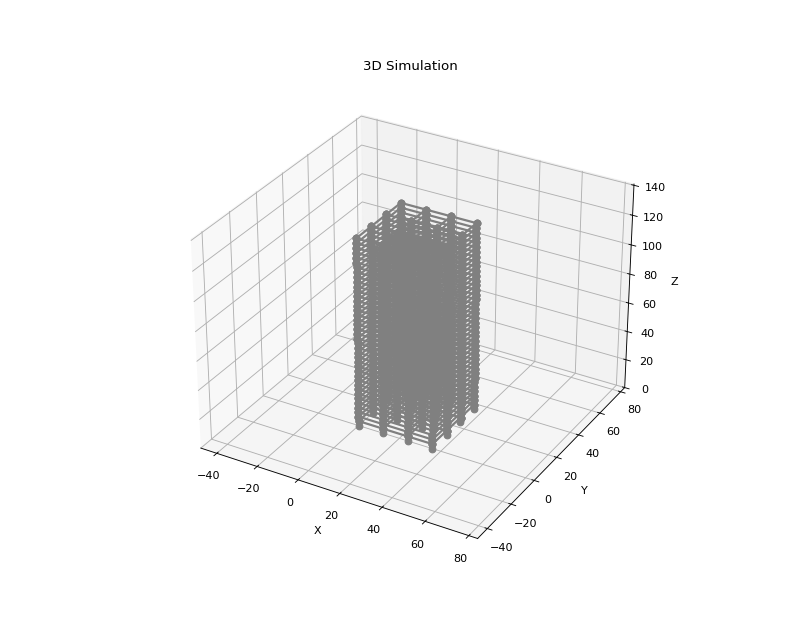

# EarthQuake Building Sim

地震時の建物挙動をシミュレーションする3D有限要素法(FEM)ベースのアプリケーション



## 機能

### 基本機能

- **2D/3D フレーム解析** - 梁柱要素によるラーメン構造解析
- **非線形解析** - Takeda/Bilinearヒステリシスモデル
- **免震・制振デバイス** - 免震ゴム・オイルダンパーモデル
- **カスタムレイアウト** - GUIで建物平面を自由に設計
- **地震波入力** - 合成波生成またはファイル読み込み
- **時刻歴解析** - Newmark-β法による動的解析

### 新機能 ✨

#### 解析機能

| 機能 | 説明 | モジュール |
|------|------|----------|
| 応答解析 | 層間変形角、塑性率、剛心・重心計算 | `response_analyzer.py` |
| バッチ解析 | 複数地震波の連続解析 | `batch_analyzer.py` |
| プッシュオーバー | 静的非線形解析、キャパシティカーブ | `pushover.py` |
| K-NET連携 | 日本の強震観測データ読込 | `knet_loader.py` |
| レポート生成 | HTML/Markdown/JSON形式 | `report_generator.py` |

#### 構造要素

| 要素 | 用途 | 備考 |
|------|------|------|
| ブレース | 座屈考慮の斜材 | 非対称バイリニア |
| TMD | 同調質量ダンパー | Den Hartog最適設計 |
| 摩擦ダンパー | クーロン摩擦モデル | スリップ変位追跡 |
| HDRB | 高減衰ゴム支承 | 2方向履歴 |

#### GUI機能

- **3Dビューワー** - インタラクティブ回転・ズーム・損傷表示
- **プロパティインスペクタ** - 接合部・解析設定の詳細設定
- **ツリービュー** - 階層構造での建物部材管理
- **プロジェクト管理** - `.eqbsim`形式での保存・読込
- **ゲーミフィケーション** - 教育用チャレンジモード

#### データベース

- **JIS断面** - 34種類のH形鋼・角形鋼管
- **材料** - 30種類の日本規格材料 (SS400, SN490等)

## インストール

```bash
git clone https://github.com/yourname/Earth_quake_building_sim.git
cd Earth_quake_building_sim

# 仮想環境作成（推奨）
python -m venv venv
venv\Scripts\activate  # Windows

# 依存関係インストール
pip install -r requirements.txt
```

## 使用方法

### GUI起動

```bash
python run.py
```

### コマンドライン

```bash
python main.py      # 2Dシミュレーション
python main_3d.py   # 3Dシミュレーション
```

### API使用例

```python
# プッシュオーバー解析
from src.pushover import PushoverAnalyzer
analyzer = PushoverAnalyzer(nodes, elements, fixed_dofs)
analyzer.set_triangular_load_pattern()
result = analyzer.run_displacement_control(target_disp=0.1, control_dof=6)

# K-NET読込
from src.knet_loader import load_knet_file
record = load_knet_file("path/to/EW.acc")
print(f"PGA: {record.max_acc} gal, Duration: {record.time[-1]}s")

# レポート生成
from src.report_generator import ReportGenerator
rg = ReportGenerator()
rg.set_metadata("解析レポート", project_name="Test")
rg.set_results(max_drift=0.01, max_disp=0.05, max_accel=5.0, ...)
rg.generate_html("report.html")
```

## 依存関係

- Python 3.9+
- NumPy, Matplotlib, Pillow
- Tkinter (Python標準)

## プロジェクト構造

```
Earth_quake_building_sim/
├── main.py / main_3d.py    # シミュレーション実行
├── run.py                  # GUI起動
├── src/
│   ├── fem.py / fem_3d.py          # 有限要素モデル
│   ├── solver.py                   # Newmark-β法ソルバー
│   ├── hysteresis.py               # ヒステリシスモデル
│   ├── devices.py                  # 免震・制振デバイス
│   ├── elements_extended.py     ★ # 拡張要素 (ブレース,TMD等)
│   ├── response_analyzer.py     ★ # 応答解析
│   ├── batch_analyzer.py        ★ # バッチ解析
│   ├── pushover.py              ★ # プッシュオーバー
│   ├── knet_loader.py           ★ # K-NET連携
│   ├── report_generator.py      ★ # レポート生成
│   ├── section_database.py      ★ # JIS断面DB
│   ├── material_library.py      ★ # 材料ライブラリ
│   ├── gui.py                      # メインGUI
│   └── ...
├── tests/                  # テストコード
└── config.yaml             # 設定ファイル
```

★ = 新規追加モジュール

## 物理モデル

### 単位系 (SI)

| 物理量 | 単位 |
|-------|------|
| 長さ | m |
| 力 | N |
| 質量 | kg |
| 加速度 | m/s² または gal (1gal = 0.01 m/s²) |

### 解析手法

- **時間積分**: Newmark-β法 (β=0.25, γ=0.5)
- **減衰**: Rayleigh減衰
- **非線形解法**: Newton-Raphson法

## テスト

```bash
python -m pytest tests/ -v
```

## ライセンス

MIT License

## 貢献

Issue/PRを歓迎します！！
